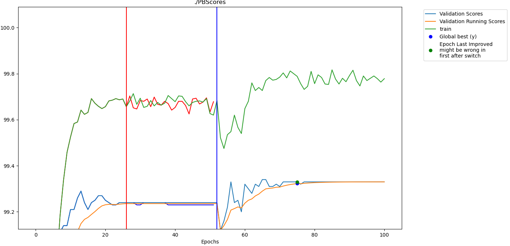
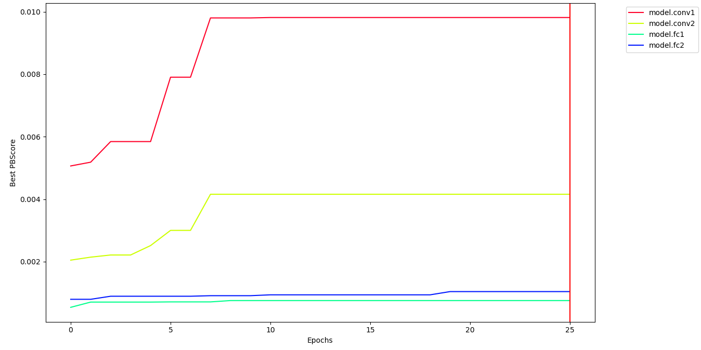

# PAI-API

The purpose of this repository is to provide a walkthrough for how to add Perforated AI's Perforated Backpropagationtm to your code.  When starting a new project first just add the sections from this README. Once they have been added you can run your code and it will give you errors and warnings about if any "customization" coding is actually required for your architecture.  The ways to fix these are in [customization.md](customization.md).  After running your pipeline you can view the graph that shows the correlation values and experiment with the other settings in customization.md that may help get better results. 

If you have not done so yet go to our [website](https://www.perforatedai.com/getstarted) and fill out the form to get your RSA license file which is required to run our software.  Once we have emailed it to you, just put it in the same folder as you run your program from and the software will find it.

## 1 - Main Script
### 1.1 - Imports
These are all the imports you will need at the top of your main training file.  They will be needed in all of your files that call these functions if some of the below ends up being put into other files.

    from perforatedai import globalsFile as gf
    from perforatedai import pb_models as PBM
    from perforatedai import pb_utils as PBU

### 1.2 - Configuration values
In globalsFile.py there are many different configuration settings you can play with.  The following ones are the most important which do not have default values because they should be considered.  More details can be found in globalsFile.py, but brief explanations are here.

    gf.switchMode = gf.doingHistory # When to switch between Dendrite learning and neuron learning. 
    # How many normal epochs to wait for before switching modes.  
    # Make sure this is higher than your scheduler's patience. 
    gf.nEpochsToSwitch = 10  
    gf.pEpochsToSwitch = 10  # Same as above for Dendrite epochs
    gf.inputDimensions = [-1, 0, -1, -1] # The default shape of input tensors
    gf.capAtN = True  # This ensures that Dendrite cycles do not take more epochs than neuron cycles
    gf.historyLookback = 1 # This can be set to a higher value if you want to load best models based on average lookback over a set of epochs, but generally just setting it to 1 to not average is best.
    
The alternative switch mode is:
    

    gf.switchMode = gf.doingFixedSwitch # Switch on a fixed number of epochs rather than after improvement stops
    gf.fixedSwitchNum = 10 # How many epochs to cause a switch
    # If you would like the first one to run longer since its your original training
    # you can set this value to be different
    gf.firstFixedSwitchNum = 10  
    
The following can also be added if you would like to save each model before switching modes.  This can be helpful for loading intermediary networks for additional testing.  

    gf.testSaves = True

The following here can be added if you want Dendrite training to not be capped at the same number of epochs of neuron training.  Setting this to be false means Dendrite correlation scores will be more improved, but may take a number of epochs much higher than the neurons to converge.  The additional correlation always has diminishing returns and is often not worth the extra time for systems which have a long training time.  Recommended usage is to leave this as True during experimentation and only change it to False when you have a working system and want to get the absolute most out of it.  Even then it is sometimes not recommended if your current training time takes over a day to complete.

    gf.capAtN = False
    
We recommend using defaults for your first try in general.  The one exception is switchMode.  switchMode is the setting for when to switch between standard learning and Dendrite learning.  Every switch to Dendrite learning will increase the size of your network.  Because of this you should first start with the following settings.  This will tell the function to add Dendrites at every epoch and allow you to test how many Perforated AI cycles you will be able to add before running out of memory.  This should also be used to ensure that nothing else will go wrong quickly rather than running many wasted epochs before finding out.

    gf.switchMode = gf.doingSwitchEveryTime
    gf.retainAllPB = True
    
If you are going to do this dry-run by only passing a single batch also the following:

    gf.initialCorrelationBatches = 1
    
## 2 - Network Initialization
A large benefit PAI provides is automatic conversion of networks to work with Dendrite Nodes through the convertNetwork function.
    
    
### 2.1 - Network Conversion
The call to convert network should be done directly after the model is initialized, before cuda and parallel calls.  Following is an optional params setting.
    
    model = yourModel()
    model = PBU.convertNetwork(model)
    gf.pbTracker.initialize(
        doingPB = True, #This can be set to false if you want to do just normal training 
        saveName=args.saveName,  # Change the save name for different parameter runs
    maximizingScore=True, # True for maximizing validation score, false for minimizing validation loss
    makingGraphs=True)  # True if you want graphs to be saved
    
        
### 2.2 Loading
If you need to load a run after something stopped it in the middle you can call:
    
    model = PBU.loadSystem(args.saveName, 'system', True)

If you need to load the best model for any reason you can call:

    model = PBU.loadSystem(args.saveName, 'best_model', True)
    
<!-- If something went wrong during PAI learning but the original training was fine the following is how to load that pretrained model and just restart the PAI learning -->

<!--     #load before switch -->
<!--     model = PBU.loadSystem(args.saveName, 'beforeSwitch_0', True) -->
<!--     #load after switch -->
<!--     model = PBU.loadSystem(args.saveName, 'switch_1', True) -->
<!--     gf.change any settings here that are the things you want to do differently -->

## 3 - Setup Optimizer and Scheduler

Your optimizer and scheduler should be set this way instead.  Optimizer.step() should be kept where it is, but Scheduler will get stepped inside our code so get rid of your scheduler.step() if you have one.  We recommend using ReduceLROnPlateau but any scheduler and optimizer should work.

    gf.pbTracker.setOptimizer(torch.optim.Adam)
    gf.pbTracker.setScheduler(torch.optim.lr_scheduler.ReduceLROnPlateau)
    optimArgs = {'params':model.parameters(),'lr':learning_rate}
    schedArgs = {'mode':'max', 'patience': 5} #Make sure this is lower than epochs to switch
    optimizer, scheduler = gf.pbTracker.setupOptimizer(model, optimArgs, schedArgs)
    Get rid of scheduler.step if there is one. If your scheduler is operating in a way
    that it is doing things in other functions other than just a scheduler.step this
    can cause problems and you should just not add the scheduler to our system.
    We leave this uncommented inside the code block so it is not forgotten.
    
    
    # If there is no scheduler just leave it out entirely
    optimizer = gf.pbTracker.setupOptimizer(model, optimArgs)
    
    
If your system is using a more complicated trainer where you can't just declare the optimizer outside of your system like this you are free to call the following instead of all of the above but it won't work quite as well

    gf.pbTracker.setOptimizerInstance(trainer.optimizer)

If your system has multiple optimizers just pick one of them to use.  However, when you call addValidationScore you should also reinitialize the other optimizer if restructuring happens.
    
If you are doing something separately with the scheduler or optimizer that is adjusting the learning rate based on epochs it is best if you can just define this internally in the scheduler rather than taking in epochs as a paramter to a function after the scheduler is initialized.
    
## 4 - Training
Training in general can stay exactly as is.  But at the end of your training loop if you would like to track the training score as well you can optionally add:

    gf.pbTracker.addExtraScore(trainingScore, 'train')
    
Additionally, when running PAI the system will automatically switch back and forth between normal learning and Perforated Backpropagationtm learning.  This means you don't want to have a set number of epochs.  If you are in Freemium it will give you a value when it is done, but if you have premium your system should just run until you kill it.  So in your training loop either increase your epochs if that doesn't affect learning rate etc. or set the loop to just go forever.  This may also mean you'll either need to move your test function to run every time if it was originally set up to just run once at the end or you will need to catch the kill signal which can be done like so in the training loop:

    killed = False
    while not killed:
        try:
            doing training
        except KeyboardInterrupt:
            killed = True
    
    # Then load the best model before testing
    model = PBU.loadSystem(args.saveName, 'best_model', True)

Keep in mind this will still finish the epoch it's in so it doesn't allow for immediate exit.

### 4.1 - Testing
If you have a final test that happens at the end where you load the best validation score model beforehand you can do that with the following command

    model = PBU.loadSystem(saveName, 'best_model', True)
    
If you run testing periodically at the same time when you run validation (this is recommended) You can also call.

    gf.pbTracker.addTestScore(trainingScore, 'test score')
    
The test score should obviously not be used in the same way as the validation score for early stopping or other decisions.  However, by calculating it at each epoch and calling this function the system will automatically keep track of the affiliated test score of the highest validation score during each neuron training iteration.  This will create a CSV file (..bestTestScore.csv) for you that very neatly keeps track of the parameter counts of each cycle as well as what the test score was at the point of the highest validation score for that Dendrite count.  If you do not call this function it will use the validation score when producing this CSV file.
    
    
## 5 - Validation
### 5.1 Main Validation Requirements
At the end of your validation loop the following must be called so the tracker knows when to switch between Dendrite learning and normal learning

    model, improved, restructured, trainingComplete = gf.pbTracker.addValidationScore(score, 
    model, # .module if its a dataParallel
    args.saveName)
    Then following line should be replaced with whatever is being used to set up the gpu settings, including PAIDataParallel
    model.to(device)
    if(trainingComplete):
        Break the loop or do whatever you need to do once training is over
    elif(restructured): if it does get restructured, reset the optimizer with the same block of code you use above.
        optimArgs = {'params':model.parameters(),'lr':learning_rate}
        schedArgs = {'mode':'max', 'patience': 5} #Make sure this is lower than epochs to switch
        optimizer, scheduler = gf.pbTracker.setupOptimizer(model, optimArgs, schedArgs)
    
Description of variables:

    model - This is the model to continue using.  It may be the same model or a restructured model
    improved - This is true if the current model has improved upon previous ones and is the 
    current best.  This variable can be used however you wish.
    restructired - This is True if the model has been restructired, either by adding new 
    Dendrites, or by incorporating trained dendrites into the model.
    trainingComplete - This is True if the training is completed and further training will
    be performed.  This is currently only True if you are using our freemium service before
    adding a second set of Dendrites.
    score - This is the valudation score you are using to determine if the model is improving.
    It can be an actual score like accuracy or the loss value.  If you are using a loss value
    be sure when you called initialize() you set maximizingScore to False.
    
### 5.2 Separate Validation Functions
If this is called from within a test/validation function you'll need to add the following where the validation step is called

    return model, optimizer, scheduler
      
And then set them all when it is called like this
      
    model, optimizer, scheduler = validate(model, otherArgs)
        
Additionally make sure all three are being passed into the function because otherwise they won't be defined if the network is not restructured

## 6 What Your Results Should Look Like

Two graphs are automatically generated at every epoch.  The first is all of the scores you are saving.  The Validation scores and a running validation score are first to keep track of what is the deciding factor for early stopping and Dendrite learning switching.  Additionally each score that was added with addExtraScore and addTestScore will be included.  In each case a red vertical line represents a switch to Dendrite training and a blue vertical line represents a switch back to neuron training.  Additionally, when switching to Dendrite training values are retained only for display purposes for what happened before the switch since the switch triggers the weights from the best validation score to be loaded.

The second graph shows the correlation scores of each set of Dendrite Nodes.  This graph is what can be used to determine if you should be wrapping your network differently.

Graphs and model files are retained in your local directory as well for each time a switch between modes occurs to visualize what the results looked like at each step.

In addition csv files are output with the values created in the graphs.  An additional csv file is created which has the most important values in one plac ending with bestTestScores.  This csv file will track the number of parameters of your system each time a new set of Dendrites has been added as well as the test scores affiliated with the best validation scores with each architecture.  If addTestScore has not been called it just tracks the best validation scores.

### 6.1 What to Look for in the Graphs

The PB scores of every module should not be significantly lower than 0.001, if they're lower than this it means correlation isn't being learned.  To debug this look into the options in the [customization](customization.md) README and play around with the architecture with what modules are wrapped and how you are defining your processors.
    
Additionally the validation/training scores should be flatlined during Dendrite learning.  There may be minor fluctuation if you are randomizing the order of your inputs but if there are any significant changes there is a problem.  The only times we have seen this happen is when modules were not properly wrapped.  When you first initialize the network there should be a warning for modules that exist in the model that were not wrapped.  If that is being displayed when you run your system try to clear the list so everything is wrapped.  Then most importantly, if thigns are working, After every blue vertical line, your scores should be getting better.

## That's all that's Required!
With this short README you are now set up to try your first experiment.  Warnings will automatically be generated when problems occur which can be debugged using the [customization](customization.md) README.  This README also contains some suggestions at the end for optimization which can help make results even better. If there are any actual problems that are occuring that are not being caught and shown to you we have also created a [debugging](debugging.md) README with some of the errors we have seen and our suggestions about how to track them down.  Please check the debugging README first but then feel free to contact us if you'd like help.
